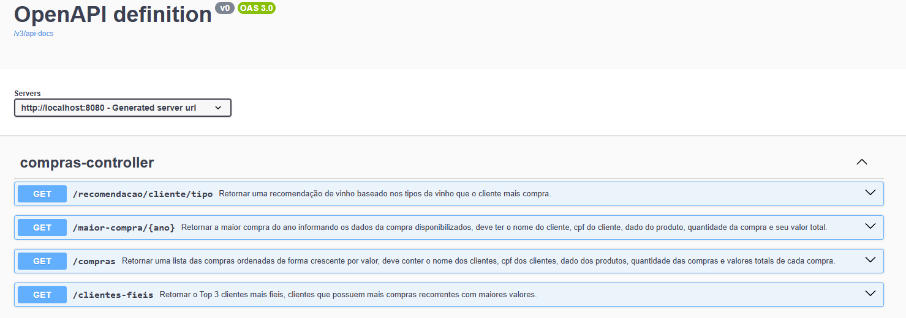

# 🍷 Digio - API de Análise de Compras de Vinhos

API desenvolvida em **Java + Spring Boot** para consumir dados externos de clientes, produtos e compras de vinhos, realizando análises como:

- Listagem de compras
- Maior compra por ano
- Clientes mais fiéis
- Recomendação de vinho baseada no histórico

O projeto foi desenvolvido utilizando **Feign Client para consumo de APIs externas** e boas práticas de organização em camadas.

---

# 🚀 Tecnologias Utilizadas

- Java 17
- Spring Boot 3.4.13
- Spring Web
- Spring OpenFeign
- Lombok
- Maven
- Swagger / OpenAPI

---

# 📂 Arquitetura do Projeto

src/main/java/com/teste/digio

controller
└── LojaController

service
├── LojaService
└── impl
└── LojaServiceImpl

client
├── ClientesComprasClient
└── ProdutosClient

dto
├── ClienteDTO
├── CompraDTO
└── ProdutoDTO

dto/response
├── ClienteFielResponse
├── ComprasClienteResponse
├── MaiorCompraResponse
└── ProdutoResponse


---

📷 Documentação Swagger

http://localhost:8080/swagger-ui/index.html#/





# ▶️ Como executar o projeto

### 1️⃣ Clonar o repositório

```bash
git clone https://github.com/AleAraujoCastro/digio.git